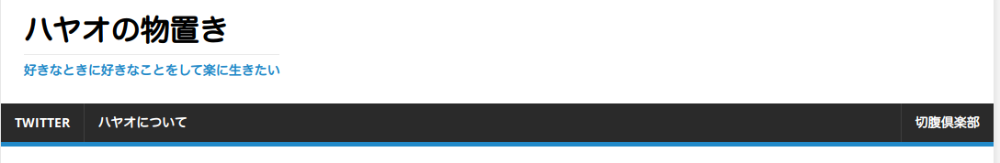
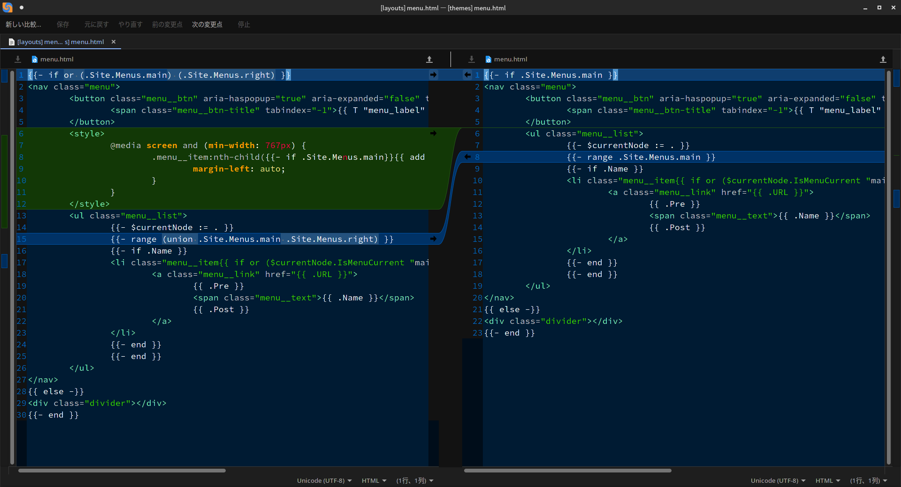

**Fascode Blogに掲載予定です**

こんにちは、山田ハヤオです。最近、自分のブログを始めました。

（内容が非常に個人的なのでここではリンクは貼らないでおきます。見たい人は頑張って探してください。）

WordPressを使ってやるほどでもないので、静的サイト生成ツールのHugoを使ってMarkDownを使って書いています。

HugoはテーマをHTMLとCSSを使って書きます。今回はそれの改造です。

## メニューを右寄せする



こんな感じで一部だけを右寄せする方法です。

デフォルトで実装されていそうな機能なのですが、いくら探しても見つからなかったのでソースコードを見たら実装されていませんでした。

なので、自分の方法で適当に実装したのでそれのメモです。

## 編集するファイルの準備
テーマの`themes/mainroad/layouts/partials/menu.html`を`layouts/partials/menu.html`にコピーしてください。

これで`menu.html`が上書きされるようになります。

## 以下の内容に編集

以下の内容に編集してください。

ソースを読んだところこのメニューにはFlexBoxを使っているらしかったので、`nth-child`擬似クラスを使用して右寄せしています。

```html
{{- if or (.Site.Menus.main) (.Site.Menus.right) }}
<nav class="menu">
	<button class="menu__btn" aria-haspopup="true" aria-expanded="false" tabindex="0">
		<span class="menu__btn-title" tabindex="-1">{{ T "menu_label" }}</span>
	</button>
	<style>
		@media screen and (min-width: 767px) {
			.menu__item:nth-child({{- if .Site.Menus.main}}{{ add (len .Site.Menus.main) 1 }}{{else}}1{{end}}){
				margin-left: auto;
			}
		}
	</style>
	<ul class="menu__list">
		{{- $currentNode := . }}
		{{- range (union .Site.Menus.main .Site.Menus.right) }}
		{{- if .Name }}
		<li class="menu__item{{ if or ($currentNode.IsMenuCurrent "main" .) ($currentNode.HasMenuCurrent "main" .) }} menu__item--active{{ end }}">
			<a class="menu__link" href="{{ .URL }}">
				{{ .Pre }}
				<span class="menu__text">{{ .Name }}</span>
				{{ .Post }}
			</a>
		</li>
		{{- end }}
		{{- end }}
	</ul>
</nav>
{{ else -}}
<div class="divider"></div>
{{- end }}


```

CSSの部分で文法エラーが出ますが、Hugoの独自文法を使用（具体的には変数）しているためのエラーです。

Hugoで正常にビルドされるので問題ありません。

## 使い方
TOML形式の設定でしかテストしていませんが他の形式でも普通にかけると思います。

```toml
[menu]
[[menu.main]]
  name = '切腹倶楽部'
  url = 'https://seppuku.club/'
  weight = -90

[[menu.main]]
  name = 'ハヤオについて'
  url = '/about/'

[[menu.main]]
  name = 'Twitter'
  url = '/twitter/'
```

こんな感じになっていると思うので、`menu`部分を`right`に変更します。

```toml
[menu]
[[menu.right]]
  name = '切腹倶楽部'
  url = 'https://seppuku.club/'
  weight = -90

[[menu.main]]
  name = 'ハヤオについて'
  url = '/about/'

[[menu.main]]
  name = 'Twitter'
  url = '/twitter/'
```

そうすると、この「切腹倶楽部」のみが右側に移動します。

## 技術的な解説

 

右寄せする要素の最初の要素に`margin-left: auto`を適用して余白を無理やり作っています。

右寄せする要素を取得する際に「左寄せされる要素の数+1」で算出しているのですが、「左寄せされる要素が0」の場合に未定義配列を参照してビルドに失敗するので、条件分岐して表現しています。

最初の行の変更は「右寄せされるメニューのみの場合」でも動作するようにするためにif文にor条件を追加しています。

このCSSは、メディアクエリを使用してPCにのみ適用されるようになっています。なのでスマホは以前と同じように表示されます。

変更点の緑色の部分はそのコードです。本当は`style.css`に書くべきですが、面倒だったのでHTMLに直書きしました。

また、設定で`menu.right`配列を定義したので、それもメニューに含めるように`union`関数を使って配列を結合しています。

ブログ特有のコードは入っていないので、Mainroadテーマならすぐに適用して使えるはずです。

## 最後に
気が向いたらもうちょいコードを整理して公式にプルリクエストを送ってみようと思います。

それでは、また今度。


