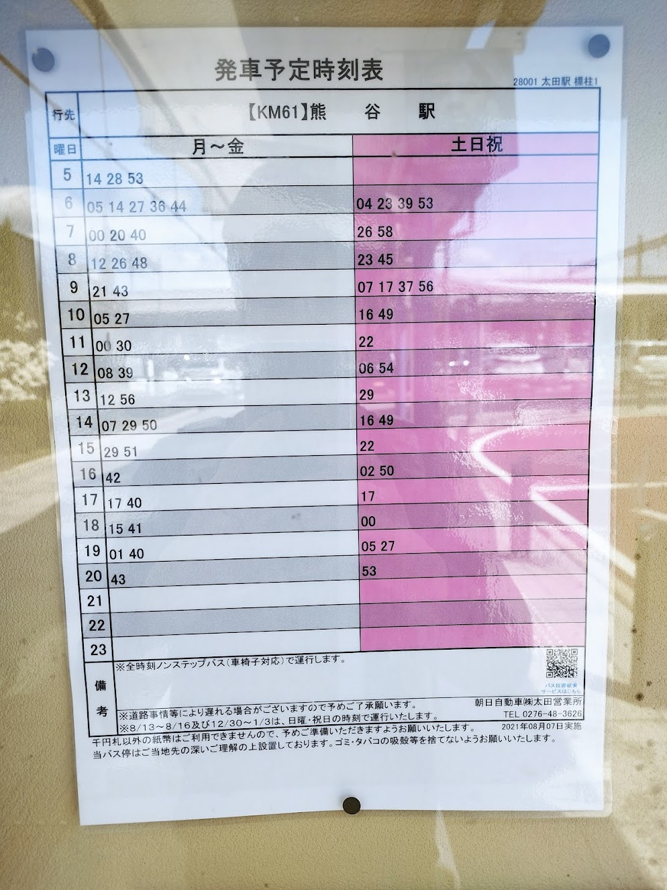
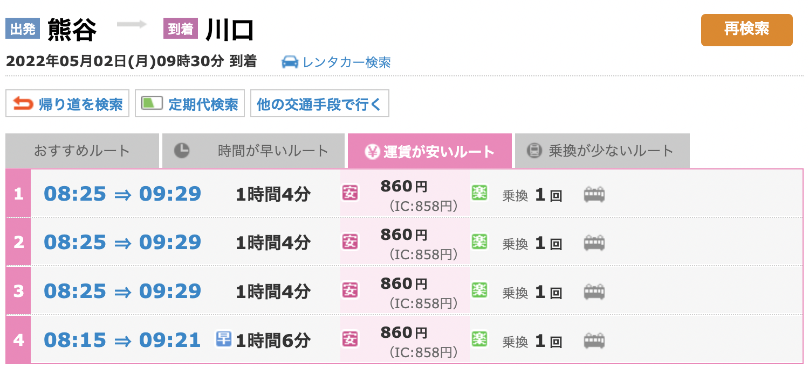
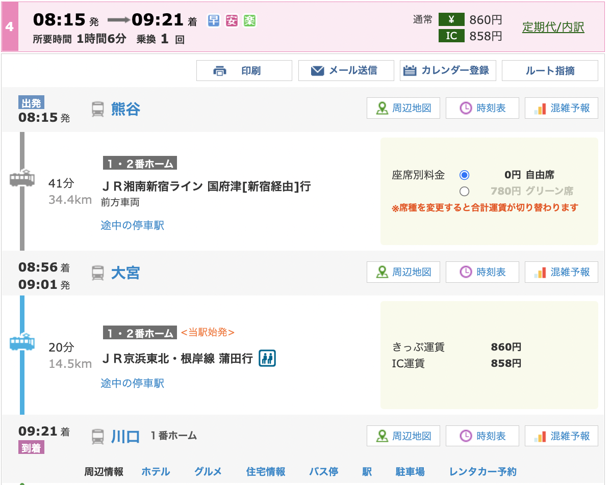
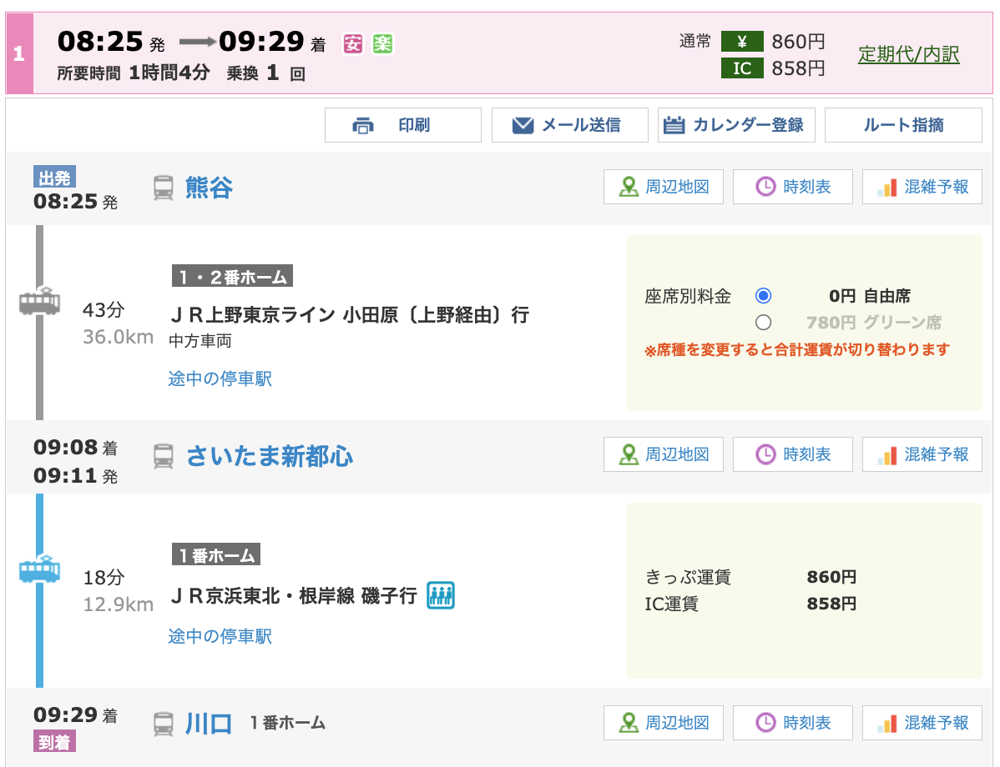

プリレコ8への参加にあたっての行動日程表、移動経路、持ち物、関連リンクを以下にまとめる。

5月2日午前1時時点での情報とする。

## 行動日程(プリレコ開始まで)

行動日程がバスで行くのか車で行くのか未定なため、両方を記載する

### バスの場合

| 到着時間 | 場所    | 詳細                           |
| ---- | ----- | ---------------------------- |
| 6:00 | もやしの家 | 起こす                          |
| 6:30 | 東武太田駅 | 自転車を駐輪場に停める（100円/24h）        |
| 6:39 | バス乗車  | 熊谷駅まで1時間を想定（Navitimeによると50分） |
| 8:00 | JR熊谷駅 | 詳細は別表参照                      |

### 車の場合

| 到着時間 | 場所      | 詳細                            |
| ---- | ------- | ----------------------------- |
| 6:30 | もやしの家   | 起こす                           |
| 7:00 | もやしの家出発 | 熊谷駅まで1時間を想定（GoogleMapによると40分） |
| 8:00 | JR熊谷駅   | 詳細は別表参照                       |

### 熊谷駅到着以降

| 到着時間  | 場所                   | 詳細                                                                   |
| ----- | -------------------- | -------------------------------------------------------------------- |
| 8:00  | JR熊谷駅（8:15か8:25発に乗る） | https://0e0.pw/4gBT                                                  |
| 9:30  | JR川口駅                | フレンディアまで徒歩5~20分+寄り道                                                  |
| 10:00 | 川口駅前市民ホール『フレンディア』    | この[サイト](https://a-nima-figure.blog.ss-blog.jp/2019-10-05)を参考に到着時間を決定 |
| 12:00 | プリレコ8開場              |                                                                      |

## 経路詳細

### 太田駅から熊谷駅

### 熊谷駅から川口駅

#### 時間表

#### メインの移動経路

#### 予備の移動経路

### 

### 川口駅からフレンディア

<iframe src="https://www.google.com/maps/embed?pb=!1m28!1m12!1m3!1d3235.934918105711!2d139.71622871531085!3d35.80153103097217!2m3!1f0!2f0!3f0!3m2!1i1024!2i768!4f13.1!4m13!3e2!4m5!1s0x6018936ef93ed8e1%3A0x2108995708cb90a4!2z5bed5Y-j6aeF44CB44CSMzMyLTAwMTcg5Z-8546J55yM5bed5Y-j5biC5qCE55S677yT5LiB55uu77yR4oiS77yS77yR!3m2!1d35.8019691!2d139.7176452!4m5!1s0x6018936e928097c1%3A0x8d627c9bf3d1b0f!2z44CSMzMyLTAwMTUg5Z-8546J55yM5bed5Y-j5biC5bed5Y-j77yR5LiB55uu77yR4oiS77yRIOODleODrOODs-ODh-OCo-OCog!3m2!1d35.801033!2d139.71848!5e0!3m2!1sja!2sjp!4v1651421472493!5m2!1sja!2sjp" width="600" height="450" style="border:0;" allowfullscreen="" loading="lazy" referrerpolicy="no-referrer-when-downgrade"></iframe>

## プリレコ後の予定

時間が余ればJRを利用して秋葉原へ行く

帰宅は親に車で拾ってもらうか、電車で帰るかのどちらか

未定なので最低限の交通費は保持しておく

## 持ち物

嵩張らず、無くしてもいいものを選ぶ

### 必需品

- 人間

- 手提げバッグ or エコバッグ

- 背中にかける系のバッグ（でかいリュックは禁止）

- 飲料水（水筒は置き忘れるので極力避ける）
  
  コンビニは高いので事前にかっておくと良い

- スマホ（予備があるとなおヨシ）

- 現金（小銭多め+5000円札以上は控える）

- Suica, Pasmo（なるべくきっぷで並びたくない）

### あるといいもの

- モバイルバッテリー+充電ケーブル

- 持ち運び用の椅子

- 筆記用具

- タオル数枚

- ゴミ袋

- 帽子

- ヒートテック

- 予備の靴下

## おまけ

ひとまず1:55に完成。変更があればここに追記。
